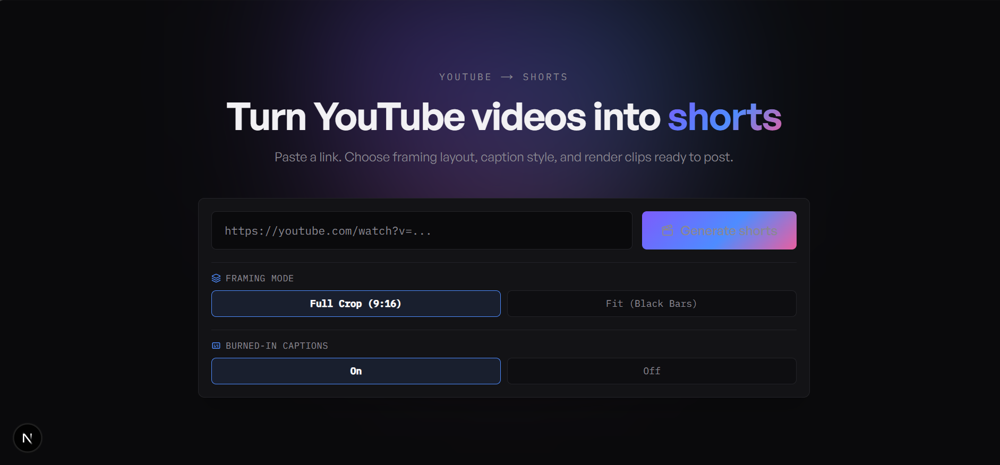

# AI Smart Clip & Short Generator

> An automated AI-powered video engineering pipeline that converts horizontal YouTube videos into vertical 9:16 short-form clips (Shorts, Reels, TikTok) complete with virality scoring, multi-framing layouts, and word-synchronized captions.

[](LICENSE)
[](#)
[](https://nextjs.org/)
[](https://fastapi.tiangolo.com/)

Paste a YouTube URL, and the app will **download** the video (via `yt-dlp`), **transcribe** the audio into word-level timestamps (Groq / OpenAI Whisper), **analyze** it with an LLM to detect the most viral 30–60 second moments, and **render** vertical 9:16 clips with FFmpeg (optionally with burned-in word-highlighted captions).

---
## Preview



---

## Features

-  Single YouTube URL → multiple finished short clips
-  AI-powered viral segment detection (virality score + hook reason)
-  Automatic **Groq → OpenAI → local fallback** routing — works even without API keys (demo mode)
-  Two **framing modes**: Full Crop (9:16) without black bars, or Fit (letterboxed black bars)
-  **Burned-In Captions toggle** for word-highlighted subtitles
-  Live job progress dashboard (download → transcribe → analyze → render)
-  Clip gallery with per-clip downloads

---

## Tech Stack

| Layer | Technology |
|-------|------------|
| **Backend** | Python 3.11+, FastAPI, Pydantic |
| **Frontend** | Next.js 16 (App Router), React 19, TypeScript, Tailwind CSS 4 |
| **ML / AI** | OpenAI SDK (Groq + OpenAI-compatible) |
| **Media** | `yt-dlp`, FFmpeg (`.ass` subtitle burn-in) |
| **Job Queue** | In-memory, thread-safe store |

---

## Project Layout

```
.
├── backend/                  # FastAPI processing pipeline
│   ├── main.py               # Application entrypoint & API endpoints
│   ├── config.py             # Global application settings
│   ├── ffmpeg_utils.py       # FFmpeg filter chains & ASS subtitle generator
│   ├── requirements.txt      # Python package dependencies
│   ├── .env.example          # Backend environment variables template
│   ├── models/
│   │   └── schemas.py        # Pydantic data validation schemas
│   ├── jobs/
│   │   └── store.py          # In-memory job state tracker
│   └── services/
│       ├── downloader.py     # Stream downloader wrapper for yt-dlp
│       ├── transcriber.py    # Speech-to-text Whisper transcription service
│       ├── analyzer.py       # LLM virality analysis & fallback logic
│       └── pipeline.py       # Asynchronous processing pipeline coordinator
│
└── frontend/                 # Next.js web application
    ├── public/
    │   └── preview.png       # Application interface preview image
    └── src/app/
        ├── page.tsx          # Studio dashboard UI (framing modes & toggle controls)
        ├── layout.tsx        # Application root layout & metadata
        └── globals.css       # Tailwind CSS v4 definitions

```

---

##  Getting Started

### Prerequisites

- **Python 3.11+**
- **Node.js 18+**
- **[FFmpeg](https://ffmpeg.org/download.html)** on your `PATH` (the backend bundles `ffmpeg.exe` / `ffprobe.exe` for Windows)

### 1. Backend setup

```bash
cd backend
python -m venv .venv
.venv\Scripts\activate        # Windows (macOS/Linux: source .venv/bin/activate)
pip install -r requirements.txt
copy .env.example .env        # then paste your API keys (optional)
uvicorn main:app --reload --host 0.0.0.0 --port 8000
```

Interactive API docs: [http://localhost:8000/docs](http://localhost:8000/docs)

> Keys are optional — leave `GROQ_API_KEY` / `OPENAI_API_KEY` blank to run in local fallback demo mode.

### 2. Frontend setup

```bash
cd frontend
npm install
npm run dev
```

Open [http://localhost:3000](http://localhost:3000). The frontend defaults to `http://localhost:8000`, override via `NEXT_PUBLIC_API_URL`.

---

## Configuration

Settings live in `backend/config.py` and can be overridden via environment variables: `groq_api_key`, `openai_api_key`, `openai_transcription_model` (`whisper-1`), `openai_analysis_model` (`gpt-4o`), `max_clips_per_job` (`3`), `ffmpeg_timeout_seconds` (`600`), and `data_dir` (`data`).

---

## API Reference

| Method | Route | Description |
|--------|-------|-------------|
| `GET` | `/` | Health check |
| `POST` | `/api/process-video` | Submit a YouTube URL and options |
| `GET` | `/api/status/{job_id}` | Poll job status & progress |
| `GET` | `/api/clips/{job_id}` | List rendered clips |
| `GET` | `/api/clips/{job_id}/download/{filename}` | Download an MP4 clip |

### Request body — `POST /api/process-video`

```json
{
  "youtube_url": "https://www.youtube.com/watch?v=dQw4w9WgXcQ",
  "render_mode": "crop",
  "subtitle_enabled": true
}
```

| Field | Type | Default | Description |
|-------|------|---------|-------------|
| `youtube_url` | string (URL) | required | YouTube video URL |
| `render_mode` | string | `crop` | `crop` (full 9:16) or `fit` (black bars) |
| `subtitle_enabled` | boolean | `true` | Burn word-highlighted captions into the clip |

---

## Verification

```bash
# Backend syntax check
cd backend
python -m py_compile main.py config.py ffmpeg_utils.py models/schemas.py jobs/store.py services/*.py

# Frontend type check
cd frontend
npx tsc --noEmit
```

---

## 📄 License & Author

**CipherCoded-Dev** · [GitHub](https://github.com/CipherCoded-Dev)

